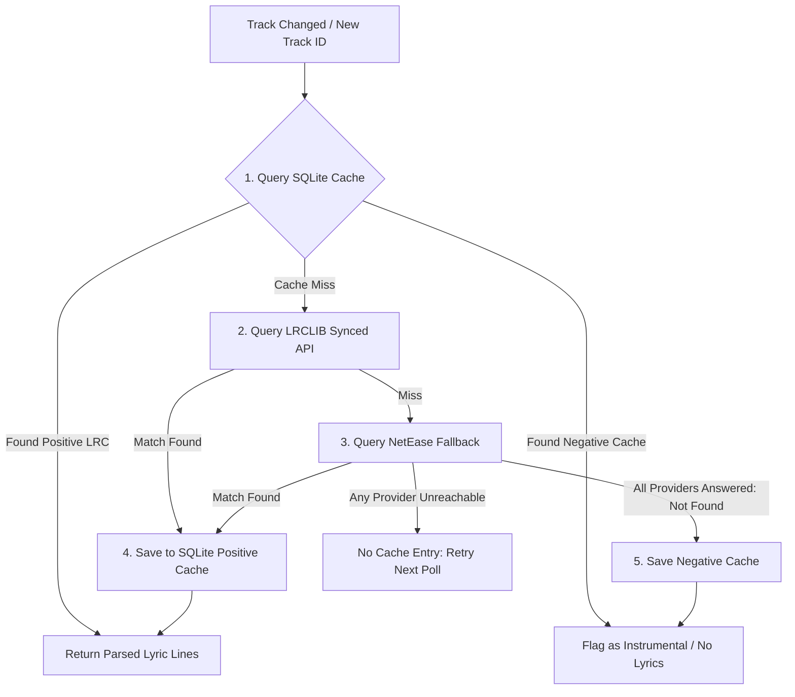

# Multi-Tier Lyrics Caching

Lyrics retrieval in Cantus is designed for instantaneous local response times and resilient fallback handling across large, diverse music catalogs.

---

## Retrieval Resolution Strategy

When a track starts playing, Cantus traverses a multi-tiered caching pipeline, then an ordered chain of lyric providers:



### Provider Fallback Chain

Lyric sources implement `ILyricsFetchProvider` and run in a configured order (`CachedLyricsService` walks the list):

1. **LRCLIB** (always first): community-driven, key-free synced and plain lyrics.
2. **NetEase Cloud Music** (optional fallback, `Netease:Enabled` in `appsettings.json`, on by default): unofficial web API with strong catalog coverage; synced lyrics only. CJK credit lines (lyricist/composer metadata) are stripped before parsing, and payload-level error codes (rate limits, anti-scraping challenges) are treated as transient failures.

Every provider classifies its result as *found*, *authoritative miss*, or *transiently unavailable*. The negative cache is only written when **every** provider authoritatively missed — an unreachable provider (network error, 5xx, or NetEase payload error code) leaves the cache untouched so the next playback poll retries.

---

## Multi-Tier Cache Features

### 1. SQLite Local Positive Cache
- **Duration**: Persistent local storage (auto-renewing on access).
- **Storage**: Raw LRC string and normalized JSON parsed line objects indexed by Spotify Track ID and Artist/Title hash.
- **Latency**: `< 1ms` retrieval from local disk.

### 2. Negative Caching for Instrumental Tracks
- **Problem**: Many classical, jazz, EDM, and post-rock tracks have no lyrics. Without caching this absence, the server would query LRCLIB on every track transition.
- **Solution**: Cantus records a **Negative Cache** entry with a configurable 30-day TTL (configured via `LyricsCache:NegativeCacheDays` in `appsettings.json`; the setting is provider-agnostic and applies to the whole fallback chain). When the track plays again, Cantus immediately recognizes it as instrumental without network queries. A negative entry is only written when every provider in the chain authoritatively reported "not found" — transient provider failures are never cached.

### 3. LRCLIB Integration & Fuzzy Matching
- **Primary Query**: Exact search by Track Name, Artist Name, Album Name, and Duration.
- **Fuzzy Fallback**: If exact matching fails (common for remastered titles, "feat." artist tags, or deluxe editions), Cantus strips noise keywords (e.g. `(Remastered 2021)`, `[Deluxe Edition]`) and queries LRCLIB's fuzzy search endpoint.

---

## LRC Parsing & Timestamp Normalization

Cantus implements a zero-allocation LRC parser (`LrcParser`) that translates standard LRC text formats into typed timestamp objects:

```text
[00:12.45]First line of synchronized lyrics
[00:15.80]Second line of synchronized lyrics
[00:22.10]Third line after a brief break
```

### Parser Features:
- Handles both 2-digit (`[mm:ss.xx]`) and 3-digit (`[mm:ss.xxx]`) millisecond precision.
- Normalizes out-of-order lyric lines.
- Computes start and end durations for each line to trigger smooth visual highlighting and transition states.
