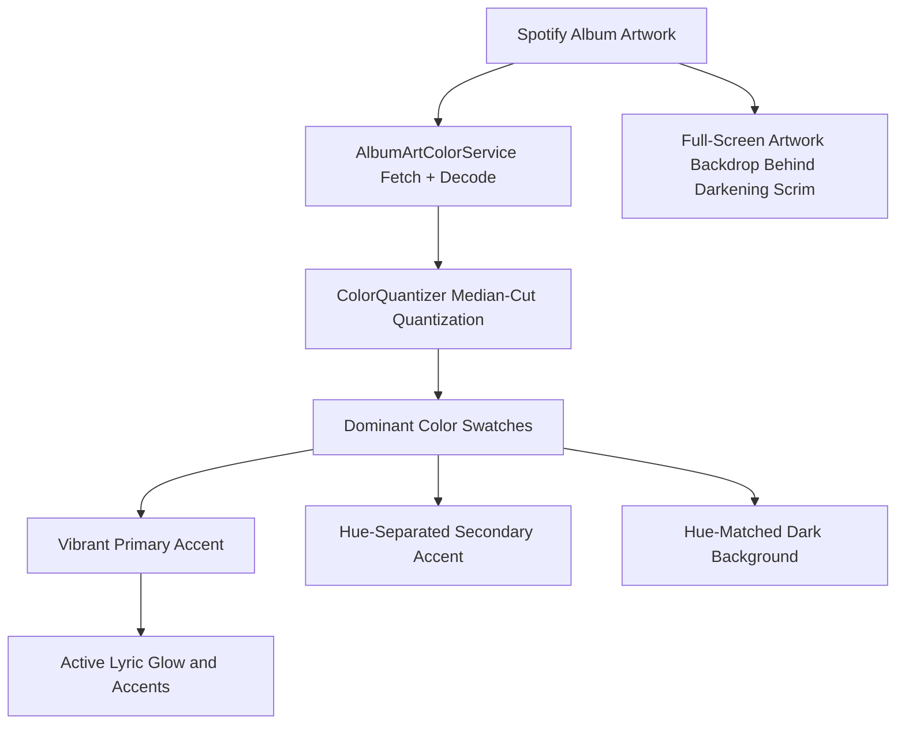
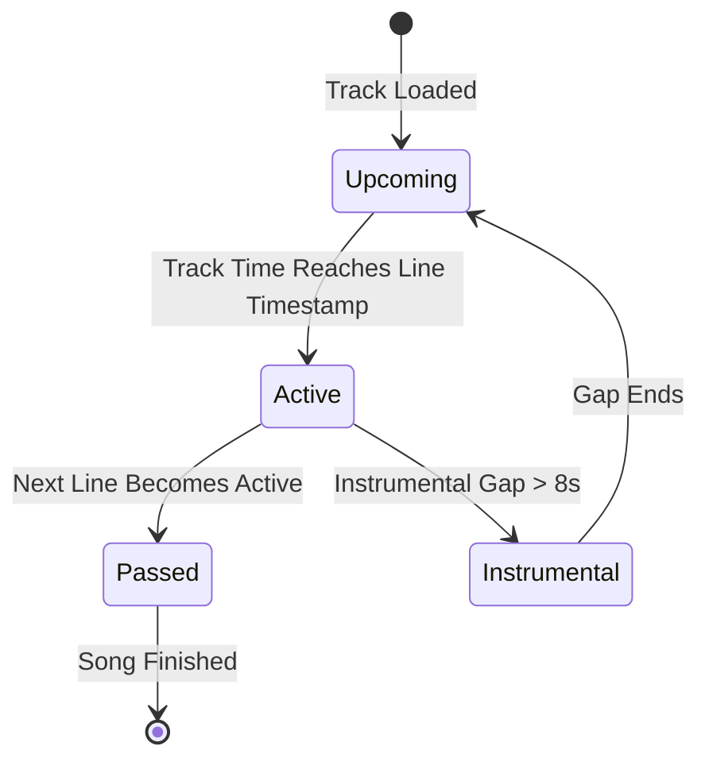

# Dynamic Theming & Visuals

Cantus features a dynamic theming engine that bridges the visual mood of your music with the lyric display.

---

## Dynamic Album Art Palette Extraction

When a new track starts playing in **Dynamic** mode, Cantus downloads the album artwork directly in the client and extracts a harmonized color palette from its pixels:

### Color Extraction Principles

1. **Median-Cut Quantization**: The artwork is downsampled and quantized into up to eight dominant color swatches. Near-black, near-white, and transparent pixels are excluded so letterboxing and vignettes do not skew the palette.
2. **Vibrancy-Weighted Accent Selection**: The primary accent is the swatch with the best combination of saturation, population, and mid-range lightness. The secondary accent prefers a swatch at least 30 degrees away in hue; grayscale artwork keeps its neutral character instead of being forced into artificial color.
3. **Legibility Clamping**: Accent saturation and lightness are clamped into ranges that keep lyrics crisp against the hue-matched dark background, regardless of how dark or washed out the artwork is.
4. **Ambient Artwork Backdrop**: The full-resolution album cover fills the entire viewport behind a darkening scrim (center-cropped to fit), so different albums produce visibly different rooms — recognizable artwork in the background, with the scrim keeping lyrics comfortably readable on top.
5. **Instant Fallback**: A metadata-derived placeholder palette is applied immediately while extraction runs, and remains active if the artwork cannot be fetched (for example, when offline). Extracted palettes are cached per artwork URL, so revisiting a track re-themes instantly.

---

## Available Theme Modes

You can switch between theme modes by pressing <kbd>T</kbd> on your keyboard or selecting the theme menu in the UI:

| Theme Mode | Description | Ideal Use Case |
| :--- | :--- | :--- |
| **Dynamic Palette** | Adapts colors, glow, and text highlights to match the current album artwork. | Daily listening, TV living room display, visualizers. |
| **Midnight Violet (Default)** | Deep indigo background with violet accents. | General use, dark rooms. |
| **Emerald Synth** | Dark slate background with emerald green accents. | Dark room viewing, low eye strain. |
| **Cyberpunk Sunset** | Dark purple-tinted background with neon rose and amber accents. | High-energy visuals. |
| **Nordic Slate** | Deep slate-navy background with cyan and sky-blue accents. | Subtle, understated displays. |
| **OLED Monochrome** | True-black background with white accents. | OLED displays, burn-in avoidance. |
| **Solarized Dark** | Classic Solarized base tones with blue accents. | Long reading sessions. |

---

## Lyric Animation States

Each line of synchronized lyrics exists in one of four distinct visual states:

- **Upcoming Lines**: Rendered with 50% opacity in neutral text color, allowing you to read upcoming words without drawing primary visual focus.
- **Active Singing Line**: Rendered with 100% opacity, enlarged font weight, vibrant accent color glow, and centered vertically in the viewport.
- **Passed Lines**: Gently dimmed (30% opacity) and scrolled upwards out of the primary viewport.
- **Instrumental Break**: A soft pulsating icon appears between lines when there is a musical interlude longer than 8 seconds.
