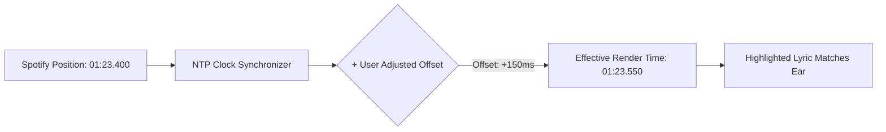

# Timing & Latency Offset Adjustment

Different sound systems introduce varying degrees of audio transmission delay. Cantus includes a precision **Latency Offset Engine** that allows you to shift lyric timing in real time to match what your ears are actually hearing.

---

## Why Audio Latency Occurs

When playing music from Spotify, the Spotify API reports where the playback cursor *should* be according to their servers. However, physical audio output often lags behind:

| Audio Output Device | Typical Delay | Cause |
| :--- | :---: | :--- |
| **Direct Headphone Jack / USB DAC** | `< 10ms` | Negligible hardware buffering. |
| **HDMI ARC / Optical Soundbar** | `30ms – 100ms` | TV audio processing & DSP decoding. |
| **Standard Bluetooth (SBC / AAC)** | `120ms – 250ms` | Wireless packet buffering and encoding. |
| **AirPlay / Chromecast Audio** | `1000ms – 2000ms` | Multi-room streaming buffer sync. |

Cantus ships with a built-in **device latency compensation** (default `200ms`) that delays lyric rendering to match typical wireless audio output. If your output is low-latency (wired headphones, USB DAC), that default makes lyrics trail the audio slightly — reduce it with <kbd>[</kbd> as described below.

---

## Real-Time Offset Adjustment

Cantus allows you to adjust the timing offset on the fly while a song is playing:



### Adjusting Per-Track Timing via UI Steppers

In the **Track Card** (Desktop/Tablet) or **Settings View** (Mobile), use the `SYNC OFFSET` stepper buttons:

- **`+0.1s` / `+0.5s`**: Nudges lyrics **earlier** if the text is highlighting after you hear the singer.
- **`-0.5s` / `-0.1s`**: Nudges lyrics **later** if the text is highlighting before you hear the singer.
- **`Reset`**: Resets the track offset back to `+0.0s`.

### Calibrating Device Latency via Keyboard

The <kbd>[</kbd> and <kbd>]</kbd> keys adjust the device-wide latency compensation in `50ms` steps:

1. Listen to the vocals while watching the highlighted line on screen.
2. If the lyrics highlight **too late** (after you hear the singer — common on wired output):
   - Press <kbd>[</kbd> to reduce the compensation; lyrics render **earlier**.
3. If the lyrics highlight **too early** (before you hear the singer — common on Bluetooth/AirPlay):
   - Press <kbd>]</kbd> to increase the compensation; lyrics render **later**.

The current value is shown as **Device Latency** in the mobile Settings view and as **Latency Compensation** in the diagnostics HUD, ranges `0–1000ms`, and persists per device/browser.

---

## Per-Track Offset Persistence

Cantus automatically stores your adjusted offset in its SQLite database keyed by the Spotify **Track ID**:

- When the same song plays again in the future, Cantus instantly applies your custom offset.
- Track-level offsets do not affect other songs that may have different mastering or timing alignments.

---

## How the Two Adjustments Compose

The effective render position is:

```
rendered position = interpolated playback position − device latency compensation + per-track offset
```

- **Device latency compensation** (keyboard <kbd>[</kbd>/<kbd>]</kbd>, settings steppers) calibrates your audio output chain once per device — it applies to every track and persists locally.
- **Per-track offsets** (the `SYNC OFFSET` steppers) handle song-specific quirks (unusual mastering, mistimed community lyrics) and stack on top of the device calibration, persisted server-side per Spotify track ID.
